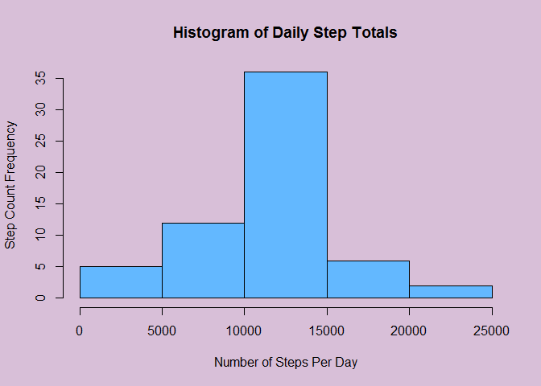

# Reproducible Research: Peer Assessment 1
MooseBowTie  
January 9, 2016  


```r
#####
## Loading and preprocessing the data
# Load the data using read_csv from the readr package
library(readr)
activity <- read_csv("activity.csv", col_types = "iDi") # (iDi) specifies (integer, Date, and integer) for the classes of the 3 columns
```


```r
#####
## What is mean total number of steps taken per day?
# Calculate the total number of steps for each day
stepsEachInterval <- split(activity$steps, activity$date) # Split the data by date
stepsEachDay <- sapply(stepsEachInterval, sum) # Sum the number of steps in each day

# Create a histagram showing the frequencies of various step count ranges
op <- par(bg="thistle") # Set a background colour for the histogram
hist(stepsEachDay, xlab="Number of Steps Per Day", ylab="Step Count Frequency", main="Histogram of Daily Step Totals", col="steelblue1")
```

\

```r
par(op) # Return to the default plot options

# Calculate the mean and median number of steps per day, ignoring NA values
mean(stepsEachDay, na.rm=TRUE)
```

```
## [1] 10766.19
```

```r
median(stepsEachDay, na.rm=TRUE)
```

```
## [1] 10765
```


```r
#####
## What is the average daily activity pattern?
# Get the average number of steps in each interval, ignoring NA values
intervalAverages <- numeric() # Create the vector that will hold the average of the step counts
count <- 1 # Keeps track of interval averages (1 to 288)
for(i in unique(activity$interval))
{     intervalAverages[count] <- mean(activity[activity$interval == i, ]$steps, na.rm = TRUE)
      count <- count + 1
}

# Make a time series plot of the average number of steps in each interval
op <- par(mar=c(4, 10, 4, 2), bg="thistle") # Adjust the plot margins, and set a background colour
plot(unique(activity$interval), intervalAverages, type="l", xlab="5-minute Intervals", ylab="Interval Averages", main="Time Series Step Analysis", col="steelblue1", lwd="2")
```

\

```r
par(op) # Return to the default plot options

which(intervalAverages == max(intervalAverages)) # Find the index of the interval with the maximun average step count
```

```
## [1] 104
```

```r
unique(activity$interval)[104] # Find the value of the interval at that index
```

```
## [1] 835
```
Interval 835 (the 104th interval) has the highest average (206.17 steps).


```r
#####
## Imputing missing values
## Examine the NA values
# Count the total number of NA values
sum(is.na(activity))
```

```
## [1] 2304
```

```r
sum(is.na(activity$steps))
```

```
## [1] 2304
```

```r
# Count the number of days and intervals that contain NA values
length(unique(activity[is.na(activity$steps), ]$date))
```

```
## [1] 8
```

```r
length(unique(activity[is.na(activity$steps), ]$interval))
```

```
## [1] 288
```
There are 2304 NA values.  All of them are in the step column.
The NA values fill 8 full days, including all 288 intervals.


```r
## Replace NAs with the mean for that interval
# Create a new data frame, called newActivity, which has the NA values replaced with interval means
newActivity <- activity

# Loop through the original data and look for NA values
for(i in 1:nrow(activity))
{     # If an NA is found, replace it
      if(is.na(activity$steps[i]))
      {     # Get the value of the current activity interval
            # Get a vector of interval values in ascending order
            # Find the index where the two are equal
            # Put that index (actually a boolean witth one true value) into interval averages
            # Assign the result to replace the missing step value
            newActivity$steps[i] <- intervalAverages[unique(activity$interval) == activity$interval[i]]
      }
}


# Calculate the total number of steps for each day
stepsEachInterval <- split(newActivity$steps, newActivity$date) # Split the data by date
stepsEachDay <- sapply(stepsEachInterval, sum) # Sum the number of steps in each day

# Create a histagram showing the frequencies various step count ranges
op <- par(bg="thistle") # Set a background colour for the histogram
hist(stepsEachDay, xlab="Number of Steps Per Day", ylab="Step Count Frequency", main="Histogram of Daily Step Totals", col="steelblue1")
```

\

```r
par(op) # Return to the default plot options 

# Calculate the mean and median number of steps per day
mean(stepsEachDay)
```

```
## [1] 10766.19
```

```r
median(stepsEachDay)
```

```
## [1] 10766.19
```
The mean is the same, but the median increased slightly.
A different method of replacing NA values would lead to different changes in the mean and median.


```r
#####
## Are there differences in activity patterns between weekdays and weekends?
## Add a factor column that shows whether or not the day is a weekday, or weekend
activity$weekday <- weekdays(activity$date) # Create a column showing the day of the week
activity$weekSection <- NA # Create a column that will be a weekday/weekend factor.  Initialize it with NA's
activity[(activity$weekday == "Saturday") | (activity$weekday == "Sunday"), ]$weekSection <- "weekend" # Fill in the "weekend" values
activity[!((activity$weekday == "Saturday") | (activity$weekday == "Sunday")), ]$weekSection <- "weekday" # Fill in the "weekday" values
activity <- activity[, c(1, 2, 3, 5)] # Remove the day-of-week column

# Split activity into two data frames: weekdays and weekends
splitAct <- split(activity, activity$weekSection)
weekdays <- splitAct[[1]]
weekends <- splitAct[[2]]

## Get the average number of steps in each interval, during the weekdays
weekdayIntervalAverages <- numeric() # Initialize the vector that will hold the interval averages
count <- 1 # Keeps track of interval averages (1 to 288)
# Loop through each of the 288 interval values, and calculate the average for each of them
for(i in unique(weekdays$interval))
{     weekdayIntervalAverages[count] <- mean(weekdays[weekdays$interval == i, ]$steps, na.rm = TRUE)
      count <- count + 1
}

## Get the average number of steps in each interval, on the weekend
weekendIntervalAverages <- numeric() # Initialize the vector that will hold the interval averages
count <- 1 # Keeps track of interval averages (1 to 288)
# Loop through each of the 288 interval values, and calculate the average for each of them
for(i in unique(weekends$interval))
{     weekendIntervalAverages[count] <- mean(weekends[weekends$interval == i, ]$steps, na.rm = TRUE)
      count <- count + 1
}

## Make two time series plots: One for weekdays, and one for the weekend
op <- par(mfrow = c(2,1), bg="thistle") # Arrange the two plots one on top of the other, and set a background colour
# Make the two plots
plot(unique(weekdays$interval), weekdayIntervalAverages, type="l", xlab="5-minute Intervals", ylab="Weekday Interval Averages", col="steelblue1", lwd="2")
title(main="Weekday Time Series")
plot(unique(weekends$interval), weekendIntervalAverages, type="l", xlab="5-minute Intervals", ylab="Weekend Interval Averages", col="steelblue1", lwd="2")
title(main="Weekend Time Series")
```

\

```r
par(op) # Return to the default plot options
```
The highest spike in average step counts is on weekday mornings, but overall, this individual is more active on the weekend.


